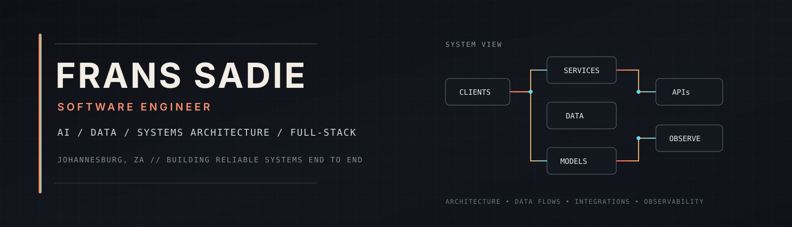

# Frans Sadie

### AI & Data Engineering • Machine Learning • Software Engineering

  
  

---

## 🧠 About Me

Hi, I'm **Frans Sadie**, a software engineer working across **AI, data, backend systems and full-stack development**.

My work usually sits somewhere between:

- **machine learning and data pipelines**
- **backend services and system integrations**
- **systems architecture and service design**
- **full-stack product development**
- **developer tooling and internal systems**
- **practical AI applications**

I like building systems that are useful, measurable and actually work outside a demo.

---

## 🎯 Current Focus

- Building **ML and data systems** with feature pipelines, model training and evaluation
- Developing **AI products** with local LLMs and structured model outputs
- Strengthening **data engineering** around ingestion, quality checks and relational data
- Designing **systems architecture** around APIs, services, data flows and integration boundaries
- Building **full-stack systems** with TypeScript, React, Node.js and PostgreSQL
- Exploring better ways to connect **AI, data and real product workflows**

---

## 💼 Experience

### Software Engineer - WDAS Technologies
**Fintech | Mar 2026 - Present**

- Work across backend services, APIs, relational data and user-facing applications
- Design and maintain system integrations, service boundaries and data flows
- Troubleshoot behaviour across client, service and database layers
- Contribute to system architecture decisions, implementation patterns and maintainability
- Work with TypeScript, JavaScript, Node.js, SQL, PostgreSQL, Docker and Git-based delivery workflows

---

## 🤖 AI, Data & Machine Learning

  
  
  
  
  
  
  

**Data work:** Pandas • NumPy • SQL • PostgreSQL • SQLite • data cleaning • feature engineering • exploratory analysis • time-series data

**ML work:** classification • regression • LightGBM • logistic regression • model comparison • cross-validation • ROC AUC • F1 • feature importance

**AI work:** local LLMs • Ollama • structured outputs • model routing • schema validation • retry and repair pipelines

**Visualisation / analytics:** Matplotlib • Seaborn • R • dplyr • tidyr • ggplot2 • RStudio

---

## 🛠️ Software Stack

### Languages

  
  
  
  

### Frameworks / Platforms / Tools

  
  
  
  
  
  
  
  

---

## 🚀 Featured Projects

| Project | Description | Stack |
|---|---|---|
| **[Market Lens](https://github.com/FransSadie/Market-lens-price)** | Market-data ML system with ingestion, feature engineering, model comparison and prediction tooling | Python · LightGBM · scikit-learn · FastAPI · PostgreSQL |
| **[TRACE](https://github.com/FransSadie/TRACE)** | Local-first desktop knowledge base for engineers | Tauri · React · TypeScript · SQLite |
| **[PSYCHED](https://github.com/FransSadie/psyched)** | Local AI journaling and coaching system with structured LLM pipelines | Next.js · PostgreSQL · Ollama · Zod |
| **[Halo](https://github.com/FransSadie/Halo)** | Scam-safety product focused on accessible user flows | TypeScript · Product Engineering |
| **[Portfolio](https://github.com/FransSadie/PersonalPorfolio)** | Personal developer portfolio | Next.js · TypeScript · React |

---

## 📡 What I Like Building

- AI and ML systems
- Data pipelines and analytics tooling
- Systems architecture and service design
- Backend services and integrations
- Full-stack applications
- Internal developer tools
- Monitoring and observability systems
- Products that solve real operational problems

---

## 📊 GitHub Stats

 

---

**AI • DATA • MACHINE LEARNING • SOFTWARE ENGINEERING**

